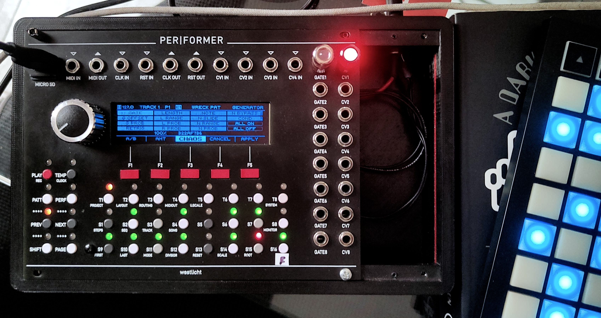

# Vinx Scorza Fork

## <a href="CHANGELOG.md" target="_blank" rel="noopener noreferrer">CHANGELOG</a>

This is a <u>personal fork</u> of the <a href="https://github.com/mebitek/performer" target="_blank" rel="noopener noreferrer">Mebitek fork</a>, itself based on the original <a href="https://github.com/westlicht/performer" target="_blank" rel="noopener noreferrer">Westlicht Performer firmware</a>.
Current fork version: `0.3.2-vinx.1.4.4`.

IMPORTANT NOTE: I am not a developer. I am an artist trying to shape and carve his own instrument.

The Vinx Scorza fork starts at `v0.3.2-vinx.1`.
Everything before that version in this repository history and changelog is inherited from the Mebitek fork and preserved as upstream reference.
This project focuses on live performance workflow, timing reliability, and UI/interaction improvements, with particular attention to modular techno and improvisation use cases.
This fork is not a general-purpose extension, but a targeted refinement of specific behaviors that come to mind while I am actively using the sequencer.
This fork is maintained for personal use. Backward compatibility with older projects, settings, or workflows is not guaranteed, and I do not assume responsibility for regressions or incompatibilities introduced by Vinx-specific changes.
The firmware is actively used and tested in practice, since PER|FORMER is the main sequencer in my live sets.
This fork would not exist without the fundamental help of AI agents during development and debugging.
I’m very grateful to <a href="https://mebitek.github.io/performer/" target="_blank" rel="noopener noreferrer">Mebitek</a> for the work done on his fork, and of course to <a href="https://westlicht.github.io/performer/" target="_blank" rel="noopener noreferrer">Simon Kallweit</a> for creating and developing the Westlicht Performer.
If you would like to support their incredible work financially, you can donate here:
<a href="https://mebitek.github.io/performer/donate/" target="_blank" rel="noopener noreferrer">Donate to Mebitek</a> · <a href="https://westlicht.github.io/performer/donate/" target="_blank" rel="noopener noreferrer">Donate to Simon Kallweit / Westlicht</a>

Personal experimental fork focused on live workflow, custom behavior, and UI/interaction changes.

Primary documentation for this fork:
- <a href="https://vinxscorza.github.io/performer/" target="_blank" rel="noopener noreferrer">Vinx Scorza fork website</a>
- <a href="https://vinxscorza.github.io/performer/manual/" target="_blank" rel="noopener noreferrer">Vinx Scorza user manual</a>
- <a href="https://vinxscorza.github.io/performer/testdrive/" target="_blank" rel="noopener noreferrer">Vinx Scorza test drive</a>
- <a href="https://github.com/VinxScorza/performer/blob/master/CHANGELOG.md" target="_blank" rel="noopener noreferrer">Vinx Scorza changelog</a>

- <a href="https://github.com/mebitek/performer" target="_blank" rel="noopener noreferrer">Mebitek Performer fork</a>
- <a href="https://github.com/westlicht/performer" target="_blank" rel="noopener noreferrer">Westlicht Performer firmware</a>

## Philosophy

This fork is driven by a simple principle:

> Make the Performer more predictable, more playable, more useful, more fun, in a live modular context.
>
> Not more features -- better behavior.

## Notes

If you're looking for a stable, conservative upstream baseline, you may prefer the original Westlicht or Mebitek lines.

If you're interested in a more hands-on, performance-oriented evolution, you're in the right place.

The Vinx Scorza website should be considered the main user-facing documentation entry point for this fork:
<a href="https://vinxscorza.github.io/performer/" target="_blank" rel="noopener noreferrer">https://vinxscorza.github.io/performer/</a>

The manual lives here:
<a href="https://vinxscorza.github.io/performer/manual/" target="_blank" rel="noopener noreferrer">https://vinxscorza.github.io/performer/manual/</a>

The changelog for this fork lives here:
<a href="https://github.com/VinxScorza/performer/blob/master/CHANGELOG.md" target="_blank" rel="noopener noreferrer">https://github.com/VinxScorza/performer/blob/master/CHANGELOG.md</a>

If you need historical upstream reference material, the Mebitek manual is still available here:
<a href="https://mebitek.github.io/performer/manual/" target="_blank" rel="noopener noreferrer">https://mebitek.github.io/performer/manual/</a>

Westlicht and Mebitek remain essential upstream references for hardware lineage, earlier firmware behavior, and project history, but this repository and its documentation are the primary reference for Vinx-specific behavior.
The current `v0.3.2-vinx.1.4.4` line includes:
- Generator preview redesign for Note-track work: `Random` now uses a central-baseline 64-step graph, while `Acid` gets dedicated Note/Gate/Slide/Phrase preview styles, visible 16-step bank focus, and a playback-following playhead
- `Acid` as a Note-track generator, with `Layer / Phrase` modes and non-destructive preview for coordinated `Gate`, `Note`, and `Slide` phrasing
- Generator menu order updated to `Random`, `Acid`, `Euclidean`, `Init Layer`, with `Acid -> Layer` exposing only the parameters that make sense for the active `Gate`, `Note`, or `Slide` layer
- `Generate -> Random` now enters with `Bias` centered at `0`, while `Euclidean` uses `NEW RAND` and no fake `VAR` slot
- Generator context action `NEW RAND` is now distinct from encoder seed changes: `Random` refreshes `Seed`, `Smooth`, and `Range`, while `Acid -> Layer` refreshes `Seed` plus the current layer's main parameter, both without touching `Variation`
- `Acid -> Layer` also mirrors `NEW RAND` onto `F5` for faster live iteration
- Generator parameter displays and entry behavior aligned around percentage-based `Range`, deterministic `Density` / `Slide` targets, and random parameter initialization with `Variation` held at `100%`
- `Dim Sequence` now offers `off`, `dim`, and `dim+`, defaulting to `dim` to better tame display noise leaking into the audio band.

Clone this repository:

```bash
git clone https://github.com/VinxScorza/performer.git
cd performer
```

Then follow the standard build instructions for Westlicht Performer below.

--- ORIGINAL DOCUMENTATION BELOW (Westlicht Performer) ---

# PER|FORMER

<a href="doc/sequencer.jpg" target="_blank" rel="noopener noreferrer"></a>

## Overview

This repository contains the firmware for the **PER|FORMER** eurorack sequencer.

For more information on the project go <a href="https://westlicht.github.io/performer" target="_blank" rel="noopener noreferrer">here</a>.

The hardware design files are hosted in a separate repository <a href="https://github.com/westlicht/performer-hardware" target="_blank" rel="noopener noreferrer">here</a>.

## Development

If you want to do development on the firmware, the following is a quick guide on how to setup the development environment to get you going.

### Setup on macOS and Linux

First you have to clone this repository (make sure to add the `--recursive` option to also clone all the submodules):

```
git clone --recursive https://github.com/VinxScorza/performer.git
```

After cloning, enter the performer directory:

```
cd performer
```

Make sure you have a recent version of CMake installed. If you are on Linux, you might also want to install a few other packages. For Debian based systems, use:

```
sudo apt-get install libtool autoconf cmake libusb-1.0.0-dev libftdi-dev pkg-config
```

To compile for the hardware and allow flashing firmware you have to install the ARM toolchain and build OpenOCD:

```
make tools_install
```

Next, you have to setup the build directories:

```
make setup_stm32
```

If you also want to compile/run the simulator use:

```
make setup_sim
```

The simulator is great when developing new features. It allows for a faster development cycle and a better debugging experience.

### Setup on Windows

Currently, there is no native support for compiling the firmware on Windows. As a workaround, there is a Vagrantfile to allow setting up a Vagrant virtual machine running Linux for compiling the application.

First you have to clone this repository (make sure to add the `--recursive` option to also clone all the submodules):

```
git clone --recursive https://github.com/VinxScorza/performer.git
```

Next, go to <a href="https://www.vagrantup.com/downloads.html" target="_blank" rel="noopener noreferrer">https://www.vagrantup.com/downloads.html</a> and download the latest Vagrant release. Once installed, use the following to setup the Vagrant machine:

```
cd performer
vagrant up
```

This will take a while. When finished, you have a virtual machine ready to go. To open a shell, use the following:

```
vagrant ssh
```

When logged in, you can follow the development instructions below, everything is now just the same as with a native development environment on macOS or Linux. The only difference is that while you have access to all the source code on your local machine, you use the virtual machine for compiling the source.

To stop the virtual machine, log out of the shell and use:

```
vagrant halt
```

You can also remove the virtual machine using:

```
vagrant destroy
```

### Build directories

After successfully setting up the development environment you should now have a list of build directories found under `build/[stm32|sim]/[release|debug]`. The `release` targets are used for compiling releases (more code optimization, smaller binaries) whereas the `debug` targets are used for compiling debug releases (less code optimization, larger binaries, better debugging support).

### Developing for the hardware

You will typically use the `release` target when building for the hardware. So you first have to enter the release build directory:

```
cd build/stm32/release
```

To compile everything, simply use:

```
make -j
```

Using the `-j` option is generally a good idea as it enables parallel building for faster build times.

To compile individual applications, use the following make targets:

- `make -j sequencer` - Main sequencer application
- `make -j sequencer_standalone` - Main sequencer application running without bootloader
- `make -j bootloader` - Bootloader
- `make -j tester` - Hardware tester application
- `make -j tester_standalone` - Hardware tester application running without bootloader

Building a target generates a list of files. For example, after building the sequencer application you should find the following files in the `src/apps/sequencer` directory relative to the build directory:

- `sequencer` - ELF binary (containing debug symbols)
- `sequencer.bin` - Raw binary
- `sequencer.hex` - Intel HEX file (for flashing)
- `sequencer.srec` - Motorola SREC file (for flashing)
- `sequencer.list` - List file containing full disassembly
- `sequencer.map` - Map file containing section/offset information of each symbol
- `sequencer.size` - Size file containing size of each section

If compiling the sequencer, an additional `UPDATE.DAT` file is generated which can be used for flashing the firmware using the bootloader.

To simplify flashing an application to the hardware during development, each application has an associated `flash` target. For example, to flash the bootloader followed by the sequencer application use:

```
make -j flash_bootloader
make -j flash_sequencer
```

Flashing to the hardware is done using OpenOCD. By default, this expects an Olimex ARM-USB-OCD-H JTAG to be attached to the USB port. You can easily reconfigure this to use a different JTAG by editing the `OPENOCD_INTERFACE` variable in the `src/platform/stm32/CMakeLists.txt` file. Make sure to change both occurrences. A list of available interfaces can be found in the `tools/openocd/share/openocd/scripts/interface` directory (or `/home/vagrant/tools/openocd/share/openocd/scripts/interface` when running the virtual machine).

### Developing for the simulator

Note that the simulator is only supported on macOS and Linux and does not currently run in the virtual machine required on Windows.

You will typically use the `debug` target when building for the simulator. So you first have to enter the debug build directory:

```
cd build/sim/debug
```

To compile everything, simply use:

```
make -j
```

To run the simulator, use the following:

```
./src/apps/sequencer/sequencer
```

Note that you have to start the simulator from the build directory in order for it to find all the assets.

### Source code directory structure

The following is a quick overview of the source code directory structure:

- `src` - Top level source directory
- `src/apps` - Applications
- `src/apps/bootloader` - Bootloader application
- `src/apps/hwconfig` - Hardware configuration files
- `src/apps/sequencer` - Main sequencer application
- `src/apps/tester` - Hardware tester application
- `src/core` - Core library used by both the sequencer and hardware tester application
- `src/libs` - Third party libraries
- `src/os` - Shared OS helpers
- `src/platform` - Platform abstractions
- `src/platform/sim` - Simulator platform
- `src/platform/stm32` - STM32 platform
- `src/test` - Test infrastructure
- `src/tests` - Unit and integration tests

The two platforms both have a common subdirectories:

- `drivers` - Device drivers
- `libs` - Third party libraries
- `os` - OS abstraction layer
- `test` - Test runners

The main sequencer application has the following structure:

- `asteroids` - Asteroids game
- `engine` - Engine responsible for running the sequencer core
- `model` - Data model storing the live state of the sequencer and many methods to change that state
- `python` - Python bindings for running tests using python
- `tests` - Python based tests
- `ui` - User interface

## Third Party Libraries

The following third party libraries are used in this project.

- <a href="http://www.freertos.org" target="_blank" rel="noopener noreferrer">FreeRTOS</a>
- <a href="https://github.com/libopencm3/libopencm3" target="_blank" rel="noopener noreferrer">libopencm3</a>
- <a href="https://github.com/libusbhost/libusbhost" target="_blank" rel="noopener noreferrer">libusbhost</a>
- <a href="https://github.com/memononen/nanovg" target="_blank" rel="noopener noreferrer">NanoVG</a>
- <a href="http://elm-chan.org/fsw/ff/00index_e.html" target="_blank" rel="noopener noreferrer">FatFs</a>
- <a href="https://github.com/nothings/stb/blob/master/stb_sprintf.h" target="_blank" rel="noopener noreferrer">stb_sprintf</a>
- <a href="https://github.com/nothings/stb/blob/master/stb_image_write.h" target="_blank" rel="noopener noreferrer">stb_image_write</a>
- <a href="https://sol.gfxile.net/soloud/" target="_blank" rel="noopener noreferrer">soloud</a>
- <a href="https://www.music.mcgill.ca/~gary/rtmidi/" target="_blank" rel="noopener noreferrer">RtMidi</a>
- <a href="https://github.com/pybind/pybind11" target="_blank" rel="noopener noreferrer">pybind11</a>
- <a href="https://github.com/c42f/tinyformat" target="_blank" rel="noopener noreferrer">tinyformat</a>
- <a href="https://github.com/Taywee/args" target="_blank" rel="noopener noreferrer">args</a>

## License

<a href="https://opensource.org/licenses/MIT" target="_blank" rel="noopener noreferrer"></a>

This work is licensed under a <a href="https://opensource.org/licenses/MIT" target="_blank" rel="noopener noreferrer">MIT License</a>.
